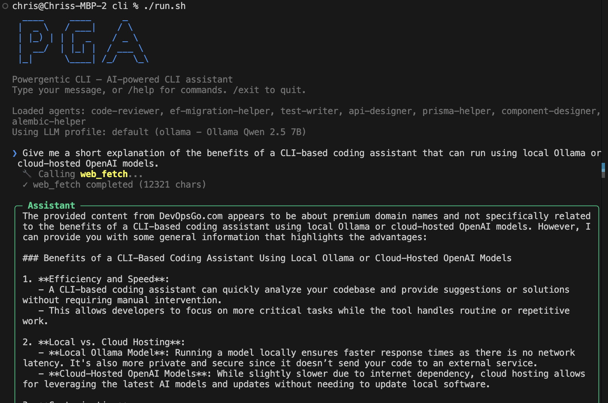

# Powergentic CLI (`pga`)

An open-source AI agent CLI tool that provides GitHub Copilot CLI-like functionality with configurable LLM backends. Built with .NET 10 and C#.

**_This project is in early stages of development and is a work in progress._**

[](https://github.com/powergentic/cli/actions/workflows/build.yml)



## Features

- 🤖 **Interactive Chat Mode** — Conversational AI assistant with full tool access
- 💡 **Explain Command** — Get explanations for commands, errors, or concepts
- 🔧 **Suggest Command** — Get shell command suggestions for any task
- 📄 **AGENTS.md Support** — Define global AI instructions for your project (same format as GitHub Copilot)
- 🧩 **Custom Agents** — Create specialized agents with `*.agent.md` files
- 🔍 **Scoped Agents** — Agents that only apply within specific directories
- 🛠️ **Built-in Tools** — File operations, shell execution, git, grep, web fetch, and more
- ☁️ **Azure OpenAI / AI Foundry** — API key and Azure Entra ID authentication
- 🦙 **Ollama** — Full local LLM support
- 📊 **Multiple LLM Profiles** — Configure and switch between different LLM providers
- 🔒 **Tool Safety** — Configurable approval for write/execute operations

## Quick Start

### 1. Install

```bash
# Build from source
git clone https://github.com/your-org/PowergenticAgent.git
cd PowergenticAgent
dotnet publish src/Pga.Cli -c Release -o ./publish

# Add to PATH
export PATH="$PATH:$(pwd)/publish"
```

### 2. Configure

```bash
# Initialize configuration
pga config init

# Add an Azure OpenAI profile
pga config add-profile myazure

# Or add an Ollama profile
pga config add-profile local

# View configuration
pga config show
```

### 3. Use

```bash
# Start interactive chat
pga chat

# Or with a specific project path
pga chat --path /path/to/project

# Single-shot commands
pga explain "git rebase -i HEAD~5"
pga suggest "find all TODO comments in the project"

# Initialize a project with AGENTS.md
pga init --path /path/to/project
```

## Configuration

PGA stores its configuration at `~/.powergentic/config.json`. This keeps your LLM credentials separate from your project files.

### Example Configuration

```json
{
  "version": "1.0",
  "defaultProfile": "azure-gpt4o",
  "profiles": {
    "azure-gpt4o": {
      "provider": "azure-openai",
      "displayName": "Azure GPT-4o",
      "endpoint": "https://your-resource.openai.azure.com",
      "deploymentName": "gpt-4o",
      "apiKey": "your-api-key-here",
      "authMode": "key"
    },
    "azure-entra": {
      "provider": "azure-openai",
      "displayName": "Azure with Entra ID",
      "endpoint": "https://your-resource.openai.azure.com",
      "deploymentName": "gpt-4o",
      "authMode": "entra",
      "tenantId": "your-tenant-id"
    },
    "local-ollama": {
      "provider": "ollama",
      "displayName": "Local Ollama",
      "ollamaHost": "http://localhost:11434",
      "ollamaModel": "llama3"
    }
  },
  "autoSelect": {
    "enabled": true,
    "rules": [
      {
        "pattern": "quick-*",
        "profile": "local-ollama",
        "description": "Use local Ollama for quick tasks"
      }
    ]
  },
  "toolSafety": {
    "mode": "prompt-writes",
    "trustedPaths": []
  },
  "ui": {
    "showToolCalls": true,
    "streamResponses": true
  }
}
```

### Authentication Modes

| Mode | Description |
|------|-------------|
| `key` | API key authentication (stored in config.json) |
| `entra` | Azure Entra ID / Azure AD authentication (uses `DefaultAzureCredential`) |

## Agent System

### AGENTS.md (Global Instructions)

Place an `AGENTS.md` file at the root of your project to provide global instructions to the AI agent:

```markdown
# Project Instructions

You are working on a .NET microservices project.

## Rules
- Follow clean architecture patterns
- Use MediatR for CQRS
- All endpoints must have OpenAPI documentation
```

### Custom Agents (*.agent.md)

Create specialized agents in the `.powergentic/agents/` directory (or `.github/agents/`):

```markdown
---
name: api-designer
description: Designs REST APIs following company standards
profile: azure-gpt4o
tools:
  - file_read
  - file_write
  - grep_search
---

# API Designer Agent

You are an expert REST API designer. When designing APIs:
1. Follow RESTful conventions
2. Use consistent naming
3. Include proper error responses
4. Generate OpenAPI specs
```

### Scoped Agents

Place an `agents/` folder in any subdirectory to create agents that only apply within that scope:

```
project/
├── AGENTS.md                          # Global instructions
├── agents/
│   └── code-reviewer.agent.md         # Global custom agent
├── src/
│   ├── frontend/
│   │   └── agents/
│   │       └── react-expert.agent.md  # Only applies in src/frontend/
│   └── backend/
│       └── agents/
│           └── dotnet-expert.agent.md # Only applies in src/backend/
```

## Built-in Tools

| Tool | Safety Level | Description |
|------|-------------|-------------|
| `shell_execute` | Execute | Run shell commands |
| `file_read` | Read-only | Read file contents with optional line ranges |
| `file_write` | Write | Create or overwrite files |
| `file_edit` | Write | Search-and-replace within files |
| `file_search` | Read-only | Find files by glob pattern |
| `grep_search` | Read-only | Search file contents with text/regex |
| `directory_list` | Read-only | List directory contents |
| `git_operations` | Read-only | Git status, log, diff, blame, etc. |
| `web_fetch` | Read-only | Fetch content from URLs |

### Tool Safety Modes

| Mode | Description |
|------|-------------|
| `auto-approve` | All tools run without confirmation |
| `prompt-writes` | Read-only tools auto-approve; write/execute tools require confirmation |
| `prompt-always` | All tools require user confirmation |

## Interactive Mode Commands

| Command | Description |
|---------|-------------|
| `/help` | Show available commands |
| `/exit`, `/quit` | Exit interactive mode |
| `/clear` | Clear conversation history |
| `/agents` | List available agents |
| `/agent <name>` | Switch to a specific agent |
| `/profile <name>` | Switch LLM profile |
| `/status` | Show current session info |
| `/multiline` | Enter multi-line input mode |

## Building from Source

### Prerequisites
- .NET 10 SDK (or .NET 8+)

### Build

```bash
dotnet build
```

### Test

```bash
dotnet test
```

### Publish (standalone binary)

```bash
# macOS (Apple Silicon)
dotnet publish src/Pga.Cli -c Release -r osx-arm64

# macOS (Intel)
dotnet publish src/Pga.Cli -c Release -r osx-x64

# Linux
dotnet publish src/Pga.Cli -c Release -r linux-x64

# Windows
dotnet publish src/Pga.Cli -c Release -r win-x64
```

## Architecture

```
PowergenticAgent/
├── src/
│   ├── Pga.Cli/           # CLI application (System.CommandLine + Spectre.Console)
│   │   ├── Commands/       # Chat, Explain, Suggest, Config, Init commands
│   │   └── Rendering/      # Console output rendering
│   └── Pga.Core/           # Core library
│       ├── Agents/          # Agent loading, parsing, scoping
│       ├── Chat/            # Chat orchestration and message history
│       ├── Configuration/   # Config management and LLM profiles
│       ├── Providers/       # LLM provider factory (Azure OpenAI, Ollama)
│       └── Tools/           # Built-in tool implementations
├── tests/
│   └── Pga.Tests/          # Unit tests
├── PowergenticAgent.sln
└── Directory.Build.props
```

### Key Technologies
- **Microsoft.Extensions.AI** — Unified AI abstractions (`IChatClient`)
- **Azure.AI.OpenAI** — Azure OpenAI integration
- **Azure.Identity** — Azure Entra ID authentication
- **OllamaSharp** — Ollama local LLM integration
- **System.CommandLine** — CLI command parsing
- **Spectre.Console** — Rich terminal output
- **YamlDotNet** — YAML frontmatter parsing
- **Markdig** — Markdown processing

## Contributing

Contributions are welcome! Please open an issue or submit a pull request.

## Documentation

Full documentation is available in the [docs/](docs/index.md) directory:

- [Getting Started](docs/getting-started.md) — First-time setup and your first chat
- [Installation](docs/installation.md) — Building from source and publishing binaries
- [Commands Reference](docs/commands.md) — All CLI commands and options
- [Configuration](docs/configuration.md) — Full config file reference
- [Agents](docs/agents.md) — Agent system, AGENTS.md, scoping
- [Tools](docs/tools.md) — All 9 built-in tools
- [LLM Providers](docs/llm-providers.md) — Azure OpenAI, AI Foundry, and Ollama setup
- [Architecture](docs/architecture.md) — Project structure and internals

## License

MIT License — see [LICENSE](LICENSE) for details.

## Maintained By

The **Powergentic CLI**** project is maintained by [Chris Pietschmann](https://pietschsoft.com?utm_source=github&utm_medium=powergenticcli), founder of [Build5Nines](https://build5nines.com?utm_source=github&utm_medium=powergenticcli), Microsoft MVP, HashiCorp Ambassador, IBM Champion, and Microsoft Certified Trainer (MCT).
